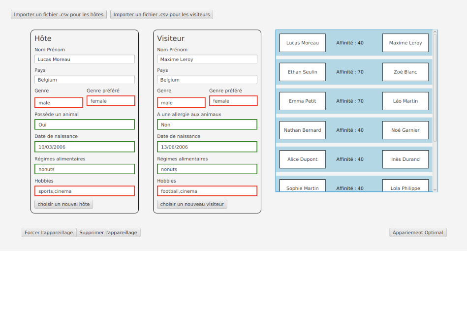

Lien des mockups figma :
[source](https://www.figma.com/design/nP8FakiXGzoBi7KPXInS2x/Paper-Wireframe-Kit--Community-?node-id=7574-2629&t=huCZo7taodJ40T4b-1)

__Pour générer la documentation:__
```javadoc -d doc/exceptions -sourcepath src -subpackages exceptions -classpath "lib\*"
javadoc -d doc/main -sourcepath src -subpackages main -classpath "lib\*"
javadoc -d doc/criteres -sourcepath src -subpackages criteres -classpath "lib\*"
```

Capture d'écran de l'application finale :



Conception et critères ergonomiques :

Pour mettre à bien ce projet, nous avons réaliser une interface en JavaFX contenant une liste d'adolescents hôtes et visiteurs.

Tout d'abord, en haut à gauche nous avons mis deux boutons pour pouvoir importer les données de fichiers csv contenant 
les informations des hôtes et des visiteurs pour les ajouter au logiciel.

Nous avons également choisi de mettre a gauche deux VBox, une affichant les informations d'un hôte sélectionné, et une autre pour un visiteur.
Par exemple, en sélectionnant un hôte on a accès à ces informations (Nom Prénom pays...) et aussi aux informations de son visiteur s'il y en a un appareiller.

Ensuite, nous avons choisi de mettre a droite la liste des adolescents en deux colonnes avec une partie l'hôte et l'autre son visiteur,
ainsi qu'une barre de recherche pour pouvoir accéder à n'importe quel élève rapidement.

Enfin, nous avons rajouter plusieurs boutons en bas de l'écran dont deux gérant les appareillages des adolescents sélectionnés (soit pour forcer leur appareillage, ou pour le supprimer)
puis un autre pour directement faire un appariement optimal par rapport à tous les adolescents.
L'appariement optimal prend en compte un score calculé entre chaque adolescents qui calcule un degré de compatibilité entre chaque hôtes et visiteurs,
une fois l'appariement réalisé à l'aide de ce bouton, le score d'affinité est affiché pour chaque couple d'adolescents.

Contributions de chaque membre en IHM :

Nous nous sommes d'abord mis tous d'accord sur la représentation du logiciel avec la maquette figma.

Ensuite, nous avons séparé le travail en plusieurs tâches dont principalement :

- L'importation des fichiers CSV (Ethan Seulin)
- Affichage de la liste des adolescents à droite (Ethan Seulin)
- Affichage des informations des étudiants (Alban Sonneville)
- Bouton d'appariement optimal avec calcul du score  (Alban Sonneville)
- Un onglet de recherche d'étudiant (Alexandre Lepoutre)
- Un bouton pour forcer l'appareillage et un autre pour le supprimer (Alexandre Lepoutre)

La vidéo de présentation du projet :

[Video application](videoIHM.mp4)